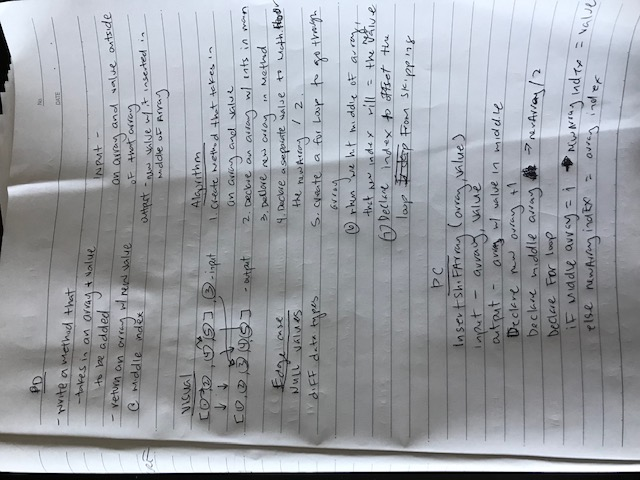

# Array Shift

*Author: Allyson Reyes*

---

### Problem Domain
Create a method that takes in an array and value. Return an array with new value inserted in the middle of the array.

---

### Inputs and Expected Outputs

| Input | Expected Output |
| :----------- | :----------- |
| [1,2,4,5], 3 | [1,2,3,4,5] |
| [2,4,6,8], 5 | [2,4,5,6,8] |

---

### Whiteboard Visual

---

### Change Log  
1.3: *Finalized code* - 3/18/2020  
1.2: *Finished with whiteboad and created the structure for challenge* - 3/18/2020  
1.1: *Started out the whiteboarding* - 3/17/2020

