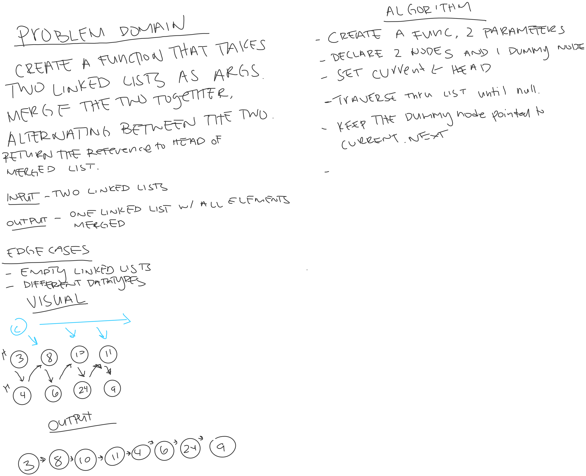

# Merge Linked Lists

*Author: Allyson Reyes*

---

### Problem Domain
Create a method that takes in two linked lists as arguments. Merge the two lists together alternating between them and return the new merged list.

---

### Inputs and Expected Outputs

| Input | Input2 |Expected Output |
| :----------- | :----------- |
| H -> [2] -> [4] -> [6] -> [8] -> X | H -> [1] -> [3] -> [5] -> [7] -> X  | H -> [1] -> [2] -> [3] -> [4] -> [5] -> [6] -> [7] -> [8] -> X |

---

### Whiteboard Visual

---

### Change Log  
1.2: *created method* - 2.26.2020 pending  
1.1: *Started out the whiteboarding* - 3.26.2020 still pending

