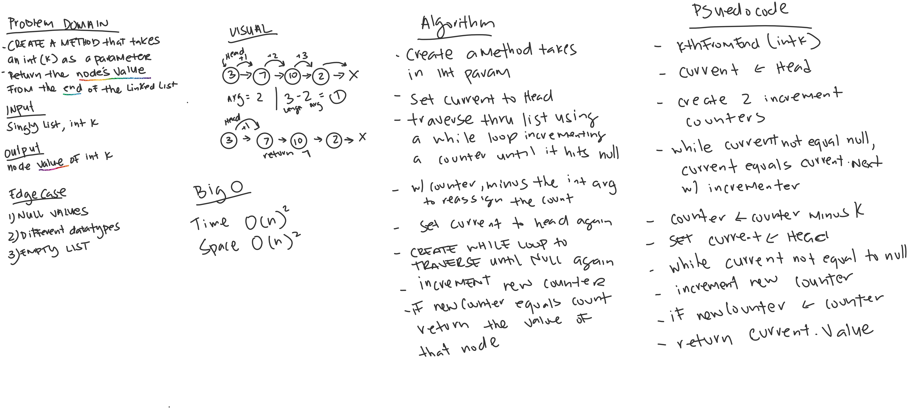

# Kth At The End

*Author: Allyson Reyes and Jin Woo Kim*

---

### Problem Domain
Create a method that takes in one parameter

---

### Inputs and Expected Outputs

| Input | Arg |Expected Output |
| :----------- | :----------- | :----------- |
| H -> [3] -> [7] -> [10] -> [2] -> X | 2 | 7 |

---

### Big O

O(n)2, because we have to traverse two times using two while loops.

### Whiteboard Visual

---

### Change Log  
1.4: *Readme completed* - 3/24/2020  
1.3: *Tests all pass* - 3/24/2020  
1.2: *Completed method* - 3/24/2020  
1.1: *Started out the whiteboarding* - 3/24/2020

