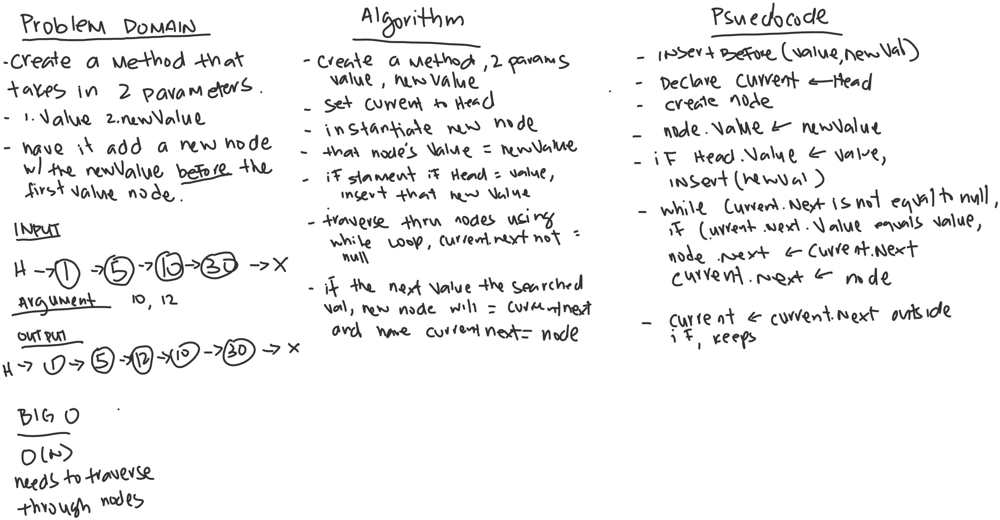

# Array Shift

*Author: Allyson Reyes*

---

### Problem Domain
Create a method that takes in 2 parameters of value and newValue.
Have it add a new node with that newValue before the searched value node.

---

### Inputs and Expected Outputs

| Input | Arg |Expected Output |
| :----------- | :----------- |
| H -> [1] -> [5] -> [10] -> [30] -> X | 10, 12 | H -> [1] -> [5] -> [12] -> [10] -> [30] -> X |

---

### Big O

O(n), because we have to traverse through the nodes to find your argument value.

### Whiteboard Visual

---

### Change Log  
1.3: *Finalized code* - 3/24/2020  
1.2: *Finished with whiteboad and created the structure for challenge* - 3/24/2020  
1.1: *Started out the whiteboarding* - 3/24/2020

