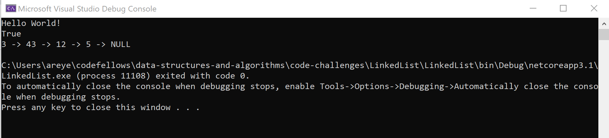

# Linked List

*Author: Allyson Reyes*

---

### Problem Domain
Create a methods when instantiating the node object, you create the head node. Created 3 methods to insert, includes, and to string.
The insert should add nodes into the linked list, includes searches through and see if the value exists, and to string prints out the nodes in the linkedlist until null.

---

### Inputs and Expected Outputs

| Input | Expected Output |
| :----------- | :----------- |
| Node | Head-Node |

---

### Result

### Resources
Referenced from the demo code provided from Amanda.  
[Link to Demo Code](https://github.com/codefellows/seattle-dotnet-401d10/tree/master/Class05/demo/LinkedList)

---

### Change Log  
1.5: *finished readme* - 3/23/2020  
1.4  *finished toString method* - 3/23/2020  
1.3: *finished the includes method* - 3/23/2020  
1.2: *finished the insert method* - 3/23/2020  
1.1: *started off with the tests* - 3/23/2020  
