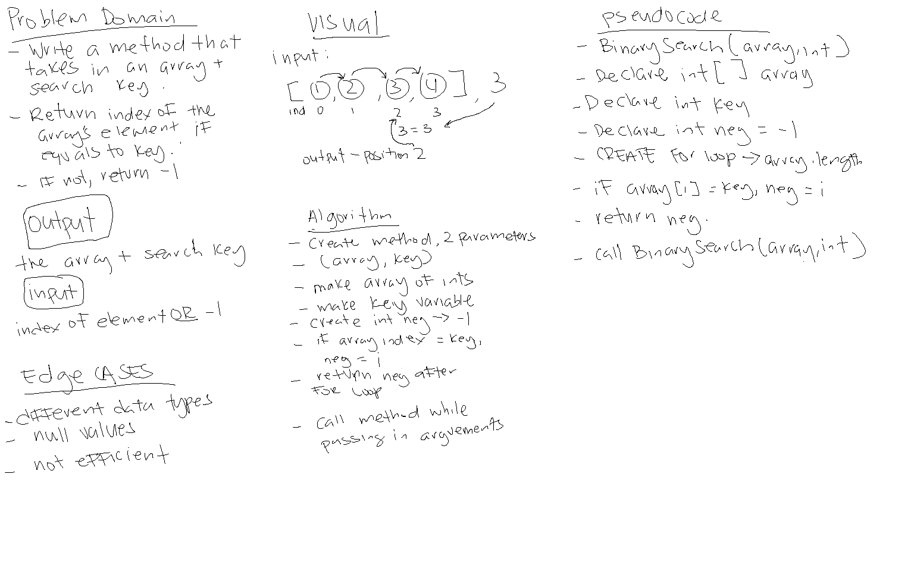

# Binary Search

*Author: Allyson Reyes*

---

### Problem Domain
Create a method that takes in 2 parameters. One is an array, the other a search key. Return the index of the search key's if it is in the array. If not, return -1.

---

### Inputs and Expected Outputs

| Input | Expected Output |
| :----------- | :----------- |
| [1,2,3,4,5], 3 | 2 |
| [2,4,5,6,8], 6 | 3 |

---

### Whiteboard Visual

---

### Change Log  
1.4  *Ran tests and both passed* - 3/18/2020  
1.3: *Finalized code in the program.cs* - 3/18/2020  
1.2: *Started coding in program.cs, able to return index but not -1* - 3/18/2020  
1.1: *Finished the whiteboarding* - 3/18/2020
